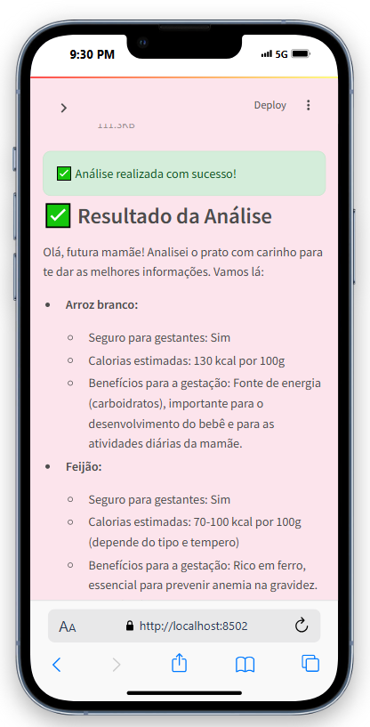
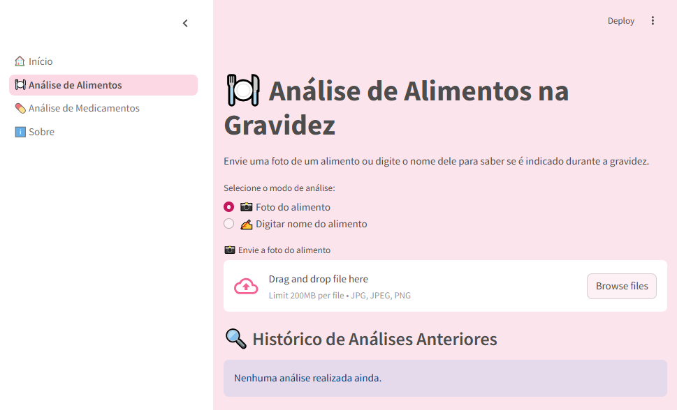

# 🍼 Alimentação e Cuidados na Gravidez — com Dra. Luma

**Uma IA gentil para ajudar gestantes a saberem o que podem (ou não) consumir durante a gravidez.**  
Inspirado na minha esposa, que está grávida e vive a dúvida diária: *“Será que posso comer isso?”* ou *“Posso tomar esse remédio?”*

Este app foi desenvolvido durante a **Imersão de IA com o Google Gemini**, promovida pela **Alura** em parceria com o **Google** (2025).  
Desde então, vem sendo aprimorado com muito carinho, tecnologia e empatia.

---

## 👶 Sobre o Projeto

O app **Dra. Luma** oferece orientações rápidas, empáticas e informativas para apoiar gestantes com dúvidas comuns do dia a dia, como:

### 🍽️ Análise de Alimentos
- ✔️ Diz se o alimento é seguro ou não na gestação  
- 🔥 Estima calorias por 100g, por unidade e até do **prato completo**  
- 💚 Informa possíveis **benefícios para a gravidez**  
- 📸 Permite análise via **foto do alimento ou embalagem**, ou pelo nome digitado  

### 💊 Análise de Medicamentos
- ✔️ Verifica se o remédio é **seguro, contraindicado ou depende**  
- ℹ️ Exibe a **categoria de risco na gravidez** (se disponível)  
- 🧠 Permite análise via **foto da embalagem** ou nome digitado  
- 💬 Gera orientações claras e acolhedoras com foco no bem-estar da mãe e do bebê  

### 🔍 Histórico Inteligente
- O app salva automaticamente as **últimas análises de alimentos e medicamentos**, facilitando a consulta e acompanhamento.

---

## 🚀 Teste o App
https://luma-gestante.streamlit.app/

---

## 🧪 Tecnologias Utilizadas

- [**Streamlit**](https://streamlit.io/) – Para a construção da interface web  
- [**Google Gemini API**](https://ai.google.dev/) – Para gerar respostas inteligentes com base em imagem e texto  
- [**Pillow (PIL)**](https://pillow.readthedocs.io/) – Para processar imagens no backend  
- [**dotenv**](https://pypi.org/project/python-dotenv/) – Para gerenciamento seguro de chaves e variáveis  
- [**Python 3.11+**](https://www.python.org/) – Linguagem base do projeto

---

## 💻 Como usar localmente

```bash
git clone https://github.com/seuusuario/LumaGestante.git
cd LumaGestante
pip install -r requirements.txt
streamlit run 0_🏠_Início.py
```

> Certifique-se de criar um arquivo `.env` com sua chave da Google Gemini API:
```
GOOGLE_API_KEY=sua-chave-aqui
```

---

## 📸 Visual do Aplicativo

### 📱 Mobile  


### 💻 Desktop  


---

## ❤️ Agradecimentos

Projeto criado com muito amor e empatia para todas as mamães que vivem com carinho e dúvida cada escolha da gestação.

Agradecimento especial à minha esposa, que inspirou esse projeto com sua jornada real de cuidado e amor.

---

## 🙌 Contribuições

Contribuições são bem-vindas!  
Você pode abrir uma **issue** ou enviar um **pull request** com ideias, melhorias ou correções.
